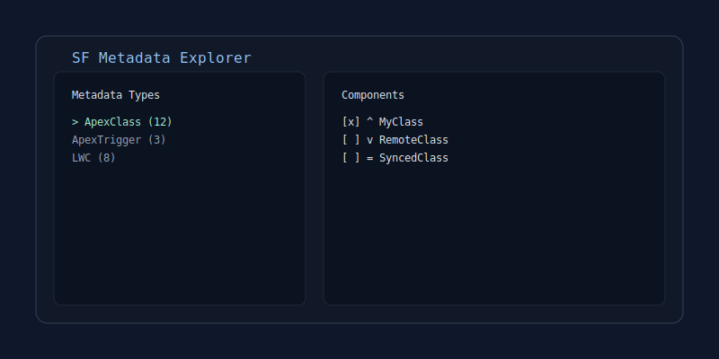

# sf-metaexplorer

`sf-metaexplorer` is a Salesforce CLI plugin with an interactive terminal UI to inspect metadata, compare local vs org state, and execute retrieve/deploy actions without manually composing long commands.

## Why use it

- Navigate metadata in a two-panel interface (types and components)
- See component status at a glance (local-only, remote-only, synced)
- Select multiple components and run retrieve/deploy in bulk
- Switch orgs from inside the UI
- Filter quickly with search and view only selected items
- Preload selection from one or more git commits

## Screenshot



## Requirements

- Node.js `>=18`
- Salesforce CLI (`sf`) installed and authenticated
- A Salesforce DX project (recommended for local metadata comparison)

## Installation

From npm:

```bash
sf plugins install sf-metaexplorer
```

From source:

```bash
npm install
sf plugins link .
```

## Usage

Start the UI:

```bash
sf metadata explorer
```

Use a specific org:

```bash
sf metadata explorer --target-org myAlias
```

Preload components changed in commits:

```bash
sf metadata explorer -p a1b2c3d -p d4e5f6a
```

## Keyboard shortcuts

| Key         | Action                             |
| ----------- | ---------------------------------- |
| Tab / h / l | Switch active panel                |
| j / k       | Move cursor                        |
| Space       | Toggle current selection           |
| a           | Toggle all in current list         |
| n           | Clear selection                    |
| /           | Search components                  |
| v           | Toggle selected-only view          |
| t           | Manage subscribed metadata types   |
| g           | Toggle object grouping             |
| o           | Open org selector                  |
| r           | Retrieve selected components       |
| d           | Deploy selected components         |
| s           | Sync metadata                      |
| c / Esc     | Cancel in-progress retrieve/deploy |
| ?           | Open help modal                    |
| q           | Quit                               |

## Supported metadata types (current)

- ApexClass, ApexTrigger, ApexComponent, ApexPage
- LightningComponentBundle, AuraDefinitionBundle
- CustomObject and object-related metadata (fields, validation rules, record types, layouts, and more)
- Flow, Profile, PermissionSet
- CustomLabels, EmailTemplate, StaticResource

## Local state

The plugin stores local cache and UI preferences in:

```text
.sf-metaexplorer/state.json
```

This file is local workspace state and should not be committed.

## Development

```bash
npm install
npm run compile
npm run lint
npm test
```

Run the command from source:

```bash
node --loader ts-node/esm ./bin/dev.js metadata:explorer
```

## Versioning

This project currently follows an early-stage `0.x` release cycle:

- `0.1.x` for fixes and small improvements
- `0.2.0+` for new features or notable UX/behavior changes
- `1.0.0` when behavior is considered stable for wider adoption

## Contributing

See `CONTRIBUTING.md`.

## License

Apache-2.0
